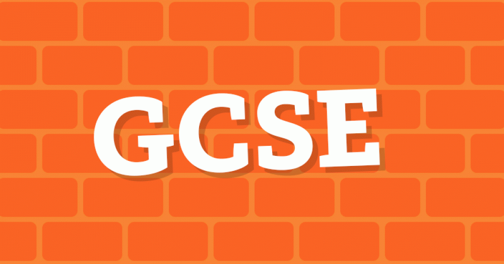

Welcome to [The GCSE Quiz!](https://gauravjagpal.github.io/Javascript-project/)!

This app has been designed to help students through their GCSE's.

Within this app, you can select a topic and complete a quiz to test your knowledge.

### Technologies used
HTML5, CSS, JavaScript

## CONTENTS
* [Code Structure](#code-structure)
    - HTML Files
    - Assets Folder
    - README File
    - Media Folder

* [User Experience (UX)](#user-experience-ux)
    - User Stories
        - Visitor Goals

* [Design](#design)
    - Colour Scheme
    - Background Colours
    - Button Colours

* [Wireframes](#wireframes)
    - Home page
    - About me page
    - Vagus Nerve page

* [Features](#features)
    - Favicon
    - Navbar
    - Landing Page
    - Features left to implement

* [Testing](#testing)
    - Validator Testing
        - W3C validator
        - Jigsaw Validator
    
    - Lighthouse Testing
        - Index page
        - About page
        - Vagus Nerve page
        - Submission Page

    - Unfixed Bugs

* [Deployment](#deployment)

* [Credits](#credits)

## Code Structure
### HTML files
I have stored all of my HTML5 files at the directory level

### Assets folder
All files complimenting my HTML have been included in the assets folder. Broken down by:
- css
- images
- js

### README file
The README file is also at directory level and the assosciated files are stored in a "media" folder

### Media Folder
The Media folder contains all of the images used in the README file

## User Experience (UX)

### User Stories

#### Visitor Goals
- A place to test knowledge gained in preparation for exams 
- Test themselves on different subjects

## Design
### Colour Scheme
I decided to use orange colours as they are bright and could help keep the user engaged. Throughout the whole app there are different shades of orange.

#### Colours used:
- color1: rgb(255, 136, 0)
- color2: rgb(255, 63, 5)
- color3: rgb(255, 105, 5)
- color4: rgb(255, 90, 5)
- color5: rgb(255, 119, 28)
- progress: rgba(255, 63, 5, 0.568) *(used for the progress bar)* 
- correct: rgb(39,161,67) *(used for the correct answer)*
- incorrect: rgb(220,53,69) *(used for the incorrect answer)*

## Wireframes
### Home page

### Quiz page

### End page

## Features
This app has 3 views:
- A home page - A page to navigate towards different quizzes
- Quiz pages - The place the user can complete different quizzes
- End page - The checkout page where the user can see there score and return to the home page

### Landing Page

The landing page is an easy to use page. Minimal information keeping it clear for the user to navigate.

### Quiz page

After selecting the topic, you will be directed to one of the quizzes.

Maths:

Physics:

History:

### Features left to implement
- Replace the subject buttons with level buttons
- Place more subjects withing each level

## Testing
### Validator testing
#### W3C validator
The html files have been run through the <a href="https://validator.w3.org/#validate_by_input"> W3C </a>validator and the below are the current status:
- [index.html](index.html) - pass - No errors or warnings